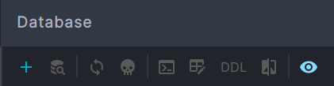

# Lancer le Projet Java avec MySQL

>Note : Ce projet utilise Java 23.0.1. Assurez-vous que cette version est bien configurée dans votre environnement.

## Étape 1 : Lancer un conteneur MySQL avec Docker

Exécutez la commande suivante pour démarrer un conteneur MySQL :

```bash
docker run --name mysql -p <Port choisi>:3306 -e MYSQL_ROOT_PASSWORD=<mdp choisi> -d mysql
```
## Étape 2 : Initialiser la Base de Données dans IntelliJ

1. Ouvrez IntelliJ IDEA.

2. Dans le volet de droite, cliquez sur l'onglet **Database**.


3. Cliquez sur le bouton **+** dans la barre supérieure, puis sélectionnez **Data Source** -> **MySQL**.




4. Dans la fenêtre de configuration qui s'ouvre, remplissez les champs suivants :
    - **Host** : `localhost`
    - **Port** : *port choisi*
    - **User** : `root`
    - **Password** : *mot de passe choisi dans la commande Docker*


5. Cliquez sur **Test Connection** pour vérifier que la connexion à la base de données fonctionne.
6. Une fois la connexion réussie, cliquez sur **OK** pour sauvegarder la configuration.

Vous avez maintenant configuré l'accès à la base de données dans IntelliJ.

## Étape 3 : Lancer le Script `initDatabase.sql`

1. Localisez le script `initDatabase` dans le projet.
2. Faites un clic droit sur le script, puis sélectionnez **Run `initDatabase.sql`**.
3. Dans la fenêtre contextuelle qui s'ouvre, choisissez la source de données cible :
    - **Target Data Source / Scheme** : sélectionnez `localhost` (ou la connexion configurée à l'étape précédente).
4. Cliquez sur **Run** pour exécuter le script.


Le script va initialiser la base de données avec les données nécessaires pour le projet.

## Étape 4 : Créer le fichier `.ENV`

1. Dans votre projet, créez un dossier/package nommé `config` à la racine.
2. À l'intérieur, créez un fichier nommé `.env`.
3. Ajoutez les variables suivantes dans ce fichier :

```env
DB_HOST = localhost
DB_PORT = <Port choisi>
DB_USER = root
DB_PASSWORD = <Mot de passe choisi>
```


## Étape 5 : Ajouter des bibliothèques au projet

Suivez les instructions ci-dessous pour télécharger et ajouter les bibliothèques nécessaires dans IntelliJ IDEA.

### 1. **Téléchargement des fichiers JAR**
Téléchargez les versions suivantes des bibliothèques nécessaires :
- **Spring Security Crypto** : [Version 6.4.2](https://mvnrepository.com/artifact/org.springframework.security/spring-security-crypto/6.4.2)
- **Apache Common Logging** : [Version 1.3.4](https://mvnrepository.com/artifact/commons-logging/commons-logging/1.3.4)
- **MySQL Connector** : [Version 9.1.0](https://mvnrepository.com/artifact/com.mysql/mysql-connector-j/9.1.0)
- **Dotenv Java** : [Version 3.1.0](https://mvnrepository.com/artifact/io.github.cdimascio/dotenv-java/3.1.0)

### 2. **Ouvrir la structure du projet**
1. Lancez IntelliJ IDEA.
2. Cliquez sur les trois petits points en haut à gauche du projet (ou allez dans `File` > `Project Structure`).


### 3. **Ajouter les bibliothèques**
1. Dans la fenêtre `Project Structure`, allez dans l'onglet **Libraries**.
2. Cliquez sur le bouton **+** pour ajouter une nouvelle bibliothèque.
3. Choisissez **Java** comme type de bibliothèque.
4. Sélectionnez le fichier `.jar` de la bibliothèque que vous avez téléchargée.
5. Cliquez sur **OK** pour valider.


### 4. **Répétez pour chaque bibliothèque**
Ajoutez les bibliothèques suivantes une par une en suivant les étapes ci-dessus :
- **spring-security-crypto-6.4.2.jar**
- **commons-logging-1.3.4.jar**
- **mysql-connector-9.1.0.jar**
- **dotenv-java-3.1.0.jar**

### 5. **Appliquer les modifications**
1. Une fois toutes les bibliothèques ajoutées, cliquez sur **Apply** puis **OK** dans la fenêtre `Project Structure`.
2. Les bibliothèques sont désormais disponibles dans votre projet.

Vous avez ajouté avec succès toutes les dépendances nécessaires au projet.


## Étape 6 : Première connexion à l'application en tant qu'Administrateur

Par défaut, un compte administrateur est disponible pour se connecter à l'application :

- **E-mail** : `admin@istore.com`
- **Mot de passe** : `root`

Utilisez ces identifiants pour accéder aux fonctionnalités administratives de l'application.
